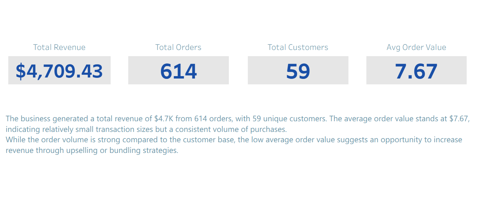
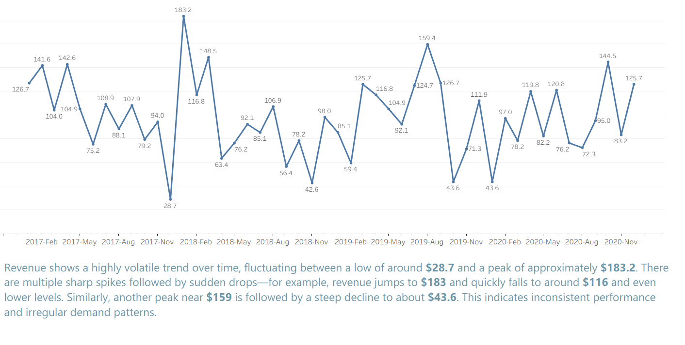
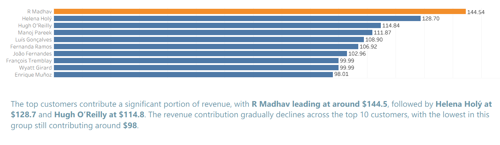
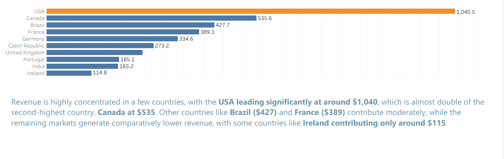
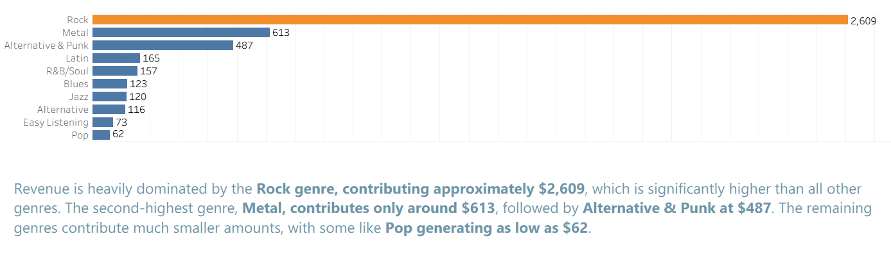
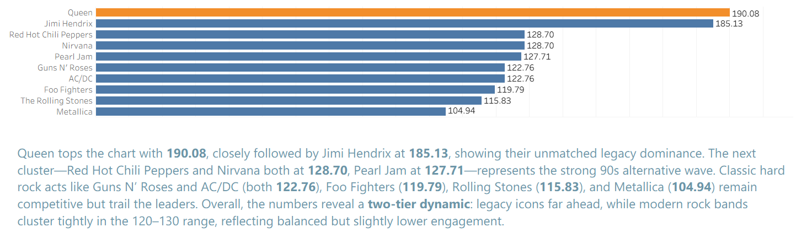
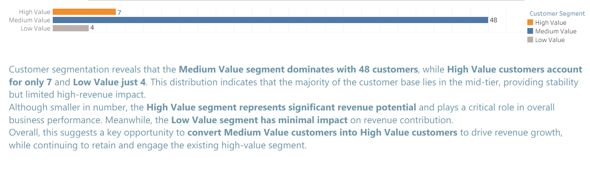
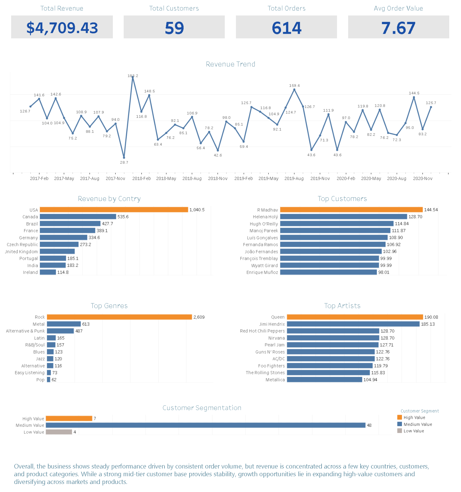

# 🎵 Music Store Sales & Customer Analytics Dashboard

## 📊 Project Overview
This project presents an end-to-end data analysis of a music store dataset using SQL (PostgreSQL) and Tableau.  
The objective is to analyze revenue performance, customer behavior, and product trends to generate actionable business insights.

---

## 🎯 Business Questions

- Which countries generate the highest revenue?
- Who are the top customers contributing to sales?
- Which genres and artists drive the most revenue?
- How does revenue trend over time?
- What is the distribution of customers across value segments?

---

## 📈 Key Insights (Data-Driven)

- The business generated **$4.7K total revenue from 614 orders across 59 customers**, with an average order value of **$7.67**, indicating high order frequency but low transaction size.  

- Revenue trends show high volatility, fluctuating between **$28 and $183**, suggesting inconsistent demand patterns rather than steady growth.  

- Revenue is geographically concentrated, with the **USA contributing ~$1,040**, nearly **2x higher than Canada (~$535)**, indicating dependency on a single market.  

- Customer contribution is moderately concentrated, with top customers generating between **$98 and $144**, showing a balanced but impactful high-value segment.  

- Product analysis reveals strong category dominance, with the **Rock genre generating ~$2,609**, which is more than **4x higher than the next category (Metal ~$613)**.  

- Customer segmentation shows **48 Medium Value customers**, compared to only **7 High Value and 4 Low Value customers**, highlighting strong potential to convert mid-tier customers into high-value contributors.  

---
## 📖 Key Insights (Story Highlights)
### KPIs

### Revenue Trend

### Top Customers

### Revenue by Country

### Top Genre

### Top Artist

### Customer Segmentation


---
## 📊 Dashboard Preview



---
## 📖 Interactive Dashboard
👉 View on Tableau Public:  
[View Dashboard](https://public.tableau.com/views/MusicStoreSalesCustomerAnalyticsDashboard/MusicTrendAnalysisInsightStory?:language=en-US&:sid=&:redirect=auth&:display_count=n&:origin=viz_share_link)
---

## DownLoad Datasets:
[Datasets](DataSets/)

## 🧠 SQL Analysis

### SQL Schema

### Download SQL Database:
[Database](SQL/Music_Store_database.sql)

The dataset was analyzed using PostgreSQL to answer key business questions.  
### View Businesss Questions:
[Questions](SQL/Music_Store_Analysis-Questions.pdf)

### Some important SQL techniques used:
- **Joins** (Customer, Invoice, Invoice Line, Track, Genre, Artist)
- **Aggregation** (SUM, COUNT, AVG)
- **Window Functions** (RANK, ROW_NUMBER)
- **Common Table Expressions (CTEs)**

### Example Query (Top Customers)

```sql
SELECT 
    c.customer_id,
    CONCAT(c.first_name, ' ', c.last_name) AS customer_name,
    SUM(i.total) AS total_spent
FROM customer c
JOIN invoice i ON c.customer_id = i.customer_id
GROUP BY c.customer_id
ORDER BY total_spent DESC
LIMIT 10;
```
### SQL Query
   [View Query](SQL/Music_Store_Project_SQL.sql)

